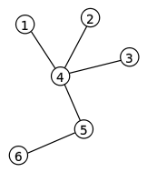

# Prüfer

A simple tool to convert Prüfer sequneces to trees.

Prüfer sequences are space-efficient representations of trees using a unique sequence. The sequence for a tree with *n* vertices has length *n - 2*. One can generate a labeled tree's Prüfer sequence by iteratively removing vertices from the tree until only two vertices remain.

## Installation

```bash
pip install prufer
```

## Usage

```bash
>>> import prufer
>>> prufer.build_tree([3, 3, 3, 4])
[(3, 0), (3, 1), (3, 2), (4, 3), (5, 4)]  # list of edges 
```

This corresponds to this tree (subtract all node labels by one):



## Algorithm

```python
def build_tree(arr: List[int]) -> Tree:
    tree = []

    graph = list(range(len(arr) + 2))
    degrees = [1] * len(graph)

    for node_index in arr:
        degrees[node_index] += 1

    for node_i in arr:
        for node_j in graph:
            if degrees[node_j] == 1:
                tree.append((node_i, node_j))
                degrees[node_i] -= 1
                degrees[node_j] -= 1
                break

    last = [index for index, val in enumerate(degrees) if val == 1]
    tree.append(tuple(reversed(last)))

    return tree
```
